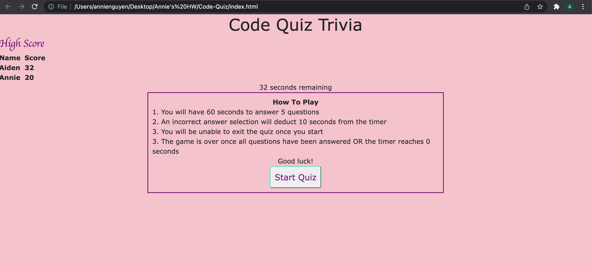

# 04 Web APIs: Code Quiz

## Overview

This is a timed, multiple choice coding quiz. Once a player starts the quiz, they will have 90 seconds to answer 5 questions. Each incorrect answer will deduct time from the timer. Once the game is over or the player has answered all five questions, they will be prompted to enter in their initials into the leaderboard. The player can play multiple times to try to beat their previous scores. 

Languages used: HTML, JavaScript, CSS

## Web Application Appearance

## Links 
https://github.com/annielnguyen/Code-Quiz